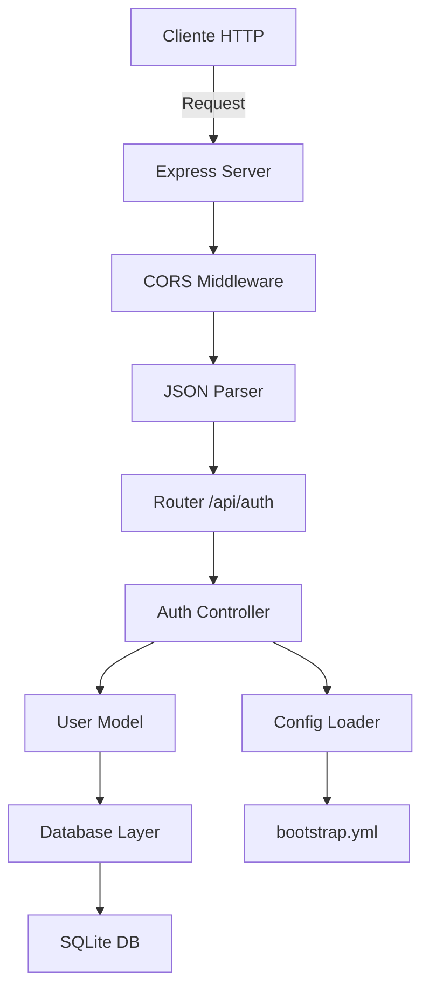
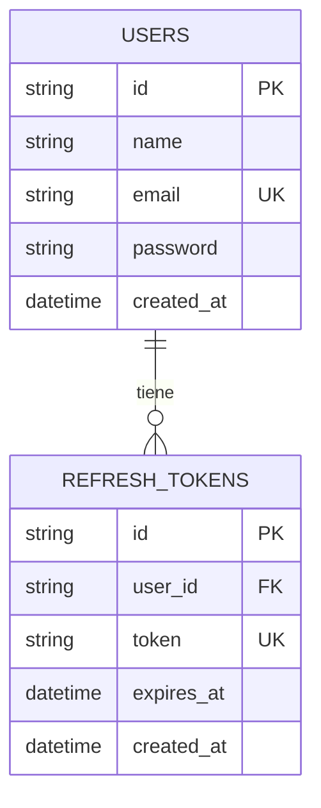
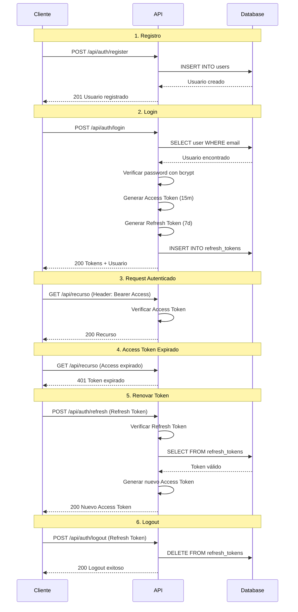

# Product Requirements Document (PRD)

## Backend API - Worklist

---

## Resumen Ejecutivo

**Nombre del Producto:** Worklist Backend API  
**Versión:** 1.0.0  
**Fecha:** Diciembre 2025  
**Estado:** En Producción  

### Descripción General

API REST backend desarrollada con TypeScript y Express que proporciona servicios de autenticación seguros para la aplicación Worklist. Implementa un sistema moderno de autenticación basado en JWT con tokens de acceso y actualización (Access + Refresh Tokens), almacenamiento en SQLite, y configuración centralizada mediante archivos YAML.

### Objetivos del Producto

1. **Seguridad Robusta**: Implementar autenticación JWT con doble token para maximizar la seguridad sin comprometer la experiencia de usuario
2. **Escalabilidad**: Arquitectura modular que permite fácil extensión de funcionalidades
3. **Mantenibilidad**: Código completamente en español, tipado estricto con TypeScript, y estructura clara
4. **Configurabilidad**: Sistema de configuración centralizado y flexible mediante `bootstrap.yml`
5. **Simplicidad**: Base de datos SQLite para desarrollo rápido y despliegue sencillo

---

## Objetivos de Negocio

### Problemas que Resuelve

- **Gestión de Sesiones Segura**: Tokens de corta duración (15 min) minimizan el riesgo de robo de credenciales
- **Experiencia de Usuario Fluida**: Refresh tokens (7 días) evitan logins frecuentes
- **Invalidación de Sesiones**: Capacidad de cerrar sesión y revocar tokens desde el servidor
- **Configuración Flexible**: Cambios de configuración sin modificar código

### Métricas de Éxito

- Tiempo de respuesta de API < 200ms para operaciones de autenticación
- 0 vulnerabilidades de seguridad críticas
- 100% de cobertura de endpoints documentados
- Código 100% en español para facilitar mantenimiento por equipos hispanohablantes

---

## Usuarios y Stakeholders

### Usuarios Primarios

1. **Desarrolladores Frontend**: Consumen la API para implementar autenticación en clientes web/móviles
2. **Usuarios Finales**: Beneficiarios indirectos de un sistema de autenticación seguro y fluido

### Stakeholders

1. **Equipo de Desarrollo**: Responsables de mantenimiento y evolución
2. **Equipo de Seguridad**: Validan implementación de mejores prácticas
3. **Product Owners**: Definen roadmap de funcionalidades

---

## Arquitectura Técnica

### Stack Tecnológico

| Componente | Tecnología | Versión | Propósito |
|------------|------------|---------|-----------|
| Runtime | Node.js | Latest | Entorno de ejecución JavaScript |
| Lenguaje | TypeScript | 5.9.3 | Tipado estático y mejor DX |
| Framework Web | Express | 5.2.1 | Servidor HTTP y routing |
| Base de Datos | SQLite (better-sqlite3) | 12.5.0 | Almacenamiento persistente |
| Autenticación | jsonwebtoken | 9.0.2 | Generación y validación JWT |
| Encriptación | bcryptjs | 3.0.3 | Hashing de contraseñas |
| Configuración | js-yaml | 4.1.1 | Parsing de bootstrap.yml |
| CORS | cors | 2.8.5 | Habilitación cross-origin |
| UUID | uuid | 13.0.0 | Generación de IDs únicos |

### Arquitectura de Capas



### Estructura de Directorios

```
backend/
├── src/
│   ├── config/
│   │   ├── configLoader.ts    # Carga y valida bootstrap.yml
│   │   └── db.ts               # Conexión y helpers de SQLite
│   ├── controllers/
│   │   └── authController.ts   # Lógica de negocio de autenticación
│   ├── models/
│   │   └── userModel.ts        # Modelo de datos de usuarios y tokens
│   ├── routes/
│   │   └── authRoutes.ts       # Definición de endpoints REST
│   └── index.ts                # Entry point de la aplicación
├── data/
│   └── database.sqlite         # Base de datos SQLite
├── bootstrap.yml               # Configuración centralizada
├── package.json
├── tsconfig.json
└── README.md
```

---

## Configuración del Sistema

### bootstrap.yml

Sistema de configuración centralizado que permite modificar comportamiento sin cambiar código:

```yaml
server:
  port: 30200                    # Puerto del servidor HTTP

database:
  path: ./data/database.sqlite   # Ruta relativa a la BD

jwt:
  accessTokenSecret: [SECRET]    # Secret para Access Tokens
  refreshTokenSecret: [SECRET]   # Secret para Refresh Tokens
  accessTokenExpiry: 15m         # Duración Access Token
  refreshTokenExpiry: 7d         # Duración Refresh Token

cors:
  enabled: true                  # Habilitar/deshabilitar CORS
  origin: "*"                    # Origins permitidos
```

**Ventajas del Enfoque YAML:**

- Separación de configuración y código
- Fácil modificación sin recompilar
- Soporte para múltiples entornos (dev, staging, prod)
- Formato legible y estándar en la industria

---

## Modelo de Datos

### Esquema de Base de Datos

#### Tabla: `users`

Almacena información de usuarios registrados.

| Campo | Tipo | Constraints | Descripción |
|-------|------|-------------|-------------|
| `id` | TEXT | PRIMARY KEY | UUID v4 único del usuario |
| `name` | TEXT | NOT NULL | Nombre completo del usuario |
| `email` | TEXT | UNIQUE, NOT NULL | Email único para login |
| `password` | TEXT | NOT NULL | Contraseña hasheada con bcrypt (10 rounds) |
| `created_at` | DATETIME | DEFAULT CURRENT_TIMESTAMP | Fecha de registro |

**Índices:**

- Índice único en `email` para búsquedas rápidas y prevención de duplicados

#### Tabla: `refresh_tokens`

Almacena refresh tokens activos para validación y revocación.

| Campo | Tipo | Constraints | Descripción |
|-------|------|-------------|-------------|
| `id` | TEXT | PRIMARY KEY | UUID v4 único del token |
| `user_id` | TEXT | NOT NULL, FK → users(id) | Referencia al usuario propietario |
| `token` | TEXT | UNIQUE, NOT NULL | Refresh token JWT completo |
| `expires_at` | DATETIME | NOT NULL | Fecha de expiración del token |
| `created_at` | DATETIME | DEFAULT CURRENT_TIMESTAMP | Fecha de creación |

**Relaciones:**

- `user_id` → `users.id` con `ON DELETE CASCADE` (eliminar tokens al borrar usuario)

**Índices:**

- Índice único en `token` para validación rápida
- Índice en `user_id` para consultas por usuario

### Diagrama Entidad-Relación



---

## Especificación de API

### Base URL

```
http://localhost:30200
```

### Endpoints

#### 1️⃣ Registrar Usuario

**Propósito:** Crear una nueva cuenta de usuario en el sistema.

**Endpoint:** `POST /api/auth/register`

**Request Body:**

```json
{
  "usuario": "Juan Pérez",
  "email": "juan@example.com",
  "password": "miPassword123"
}
```

**Validaciones:**

- Todos los campos son obligatorios
- Email debe ser único en el sistema
- Password se hashea con bcrypt (10 rounds)

**Response 201 (Éxito):**

```json
{
  "mensaje": "Usuario registrado exitosamente",
  "usuario": {
    "id": "550e8400-e29b-41d4-a716-446655440000",
    "nombre": "Juan Pérez",
    "email": "juan@example.com"
  }
}
```

**Errores:**

- `400 Bad Request`: Campos faltantes o email duplicado

  ```json
  { "mensaje": "Todos los campos son obligatorios" }
  { "mensaje": "El usuario ya existe" }
  ```

---

#### Iniciar Sesión

**Propósito:** Autenticar usuario y generar tokens de acceso.

**Endpoint:** `POST /api/auth/login`

**Request Body:**

```json
{
  "email": "juan@example.com",
  "password": "miPassword123"
}
```

**Proceso:**

1. Validar credenciales con bcrypt
2. Generar Access Token (15 min)
3. Generar Refresh Token (7 días)
4. Almacenar Refresh Token en BD
5. Retornar ambos tokens + datos de usuario

**Response 200 (Éxito):**

```json
{
  "mensaje": "Login exitoso",
  "tokenAcceso": "eyJhbGciOiJIUzI1NiIsInR5cCI6IkpXVCJ9...",
  "tokenActualizacion": "eyJhbGciOiJIUzI1NiIsInR5cCI6IkpXVCJ9...",
  "usuario": {
    "id": "550e8400-e29b-41d4-a716-446655440000",
    "nombre": "Juan Pérez",
    "email": "juan@example.com"
  }
}
```

**Payload del Access Token:**

```json
{
  "id": "550e8400-e29b-41d4-a716-446655440000",
  "email": "juan@example.com",
  "iat": 1701234567,
  "exp": 1701235467
}
```

**Errores:**

- `400 Bad Request`: Campos faltantes
- `401 Unauthorized`: Credenciales inválidas

---

#### Renovar Access Token

**Propósito:** Obtener un nuevo Access Token sin requerir login.

**Endpoint:** `POST /api/auth/refresh`

**Request Body:**

```json
{
  "tokenActualizacion": "eyJhbGciOiJIUzI1NiIsInR5cCI6IkpXVCJ9..."
}
```

**Proceso:**

1. Verificar firma del Refresh Token
2. Validar existencia en BD
3. Verificar no expiración
4. Generar nuevo Access Token (15 min)

**Response 200 (Éxito):**

```json
{
  "mensaje": "Token renovado exitosamente",
  "tokenAcceso": "eyJhbGciOiJIUzI1NiIsInR5cCI6IkpXVCJ9..."
}
```

**Errores:**

- `400 Bad Request`: Token no proporcionado
- `401 Unauthorized`: Token inválido, expirado o revocado

---

#### Cerrar Sesión

**Propósito:** Invalidar Refresh Token y cerrar sesión del usuario.

**Endpoint:** `POST /api/auth/logout`

**Request Body:**

```json
{
  "tokenActualizacion": "eyJhbGciOiJIUzI1NiIsInR5cCI6IkpXVCJ9..."
}
```

**Proceso:**

1. Eliminar Refresh Token de la BD
2. El Access Token expira naturalmente (15 min)

**Response 200 (Éxito):**

```json
{
  "mensaje": "Logout exitoso"
}
```

**Errores:**

- `400 Bad Request`: Token no proporcionado

---

#### 5️⃣ Endpoint de Prueba

**Propósito:** Verificar que el servidor está funcionando.

**Endpoint:** `GET /prueba`

**Response 200:**

```
¡Hola Mundo! Backend con TypeScript y SQLite funcionando
```

---

#### 6️⃣ Roles

**Propósito:** Gestión de roles de usuario en el sistema.

**Endpoint:** `GET /api/roles`

**Response 200 (Éxito):**

```json
[
  {
    "id": 1,
    "name": "owner"
  },
  {
    "id": 2,
    "name": "member"
  }
]
```

---

#### 7️⃣ Proyectos

**Base Endpoint:** `/api/projects`

##### Crear Proyecto

**Endpoint:** `POST /api/projects`
**Headers:** `Authorization: Bearer <token>`

**Request Body:**

```json
{
  "nombre": "Nuevo Proyecto",
  "descripcion": "Descripción opcional",
  "miembros": ["uuid-usuario-1", "uuid-usuario-2"]
}
```

**Response 201 (Éxito):**

```json
{
  "mensaje": "Proyecto creado exitosamente",
  "proyecto": {
    "id": "uuid-proyecto",
    "nombre": "Nuevo Proyecto",
    "descripcion": "Descripción opcional",
    "creadorId": "uuid-creador",
    "estado": "active",
    "creadoEn": "2025-01-01T00:00:00.000Z",
    "actualizadoEn": "2025-01-01T00:00:00.000Z"
  }
}
```

##### Listar Proyectos

**Endpoint:** `GET /api/projects`
**Propósito:** Listar todos los proyectos donde el usuario es dueño o miembro.

**Response 200 (Éxito):**

```json
[
  {
    "id": "uuid-proyecto",
    "nombre": "Mi Proyecto",
    "rol": "owner",
    "estado": "active"
  }
]
```

##### Obtener Proyecto Detallado

**Endpoint:** `GET /api/projects/:id`

**Response 200 (Éxito):**

```json
{
  "id": "uuid-proyecto",
  "nombre": "Mi Proyecto",
  "miembros": [
    {
      "id": "uuid-usuario",
      "nombre": "Juan",
      "email": "juan@example.com",
      "rol": "owner",
      "fechaUnion": "2025-01-01"
    }
  ]
}
```

##### Modificar Proyecto

**Endpoint:** `PUT /api/projects/:id`
**Permiso:** Solo Owner

**Request Body:**

```json
{
  "nombre": "Nuevo Nombre",
  "descripcion": "Nueva descripción"
}
```

##### Finalizar Proyecto

**Endpoint:** `PATCH /api/projects/:id/finish`
**Permiso:** Solo Owner
**Efecto:** Cambia estado a `finished`.

##### Eliminar Proyecto

**Endpoint:** `DELETE /api/projects/:id`
**Permiso:** Solo Owner

##### Gestionar Miembros

**Agregar Miembro:**
`POST /api/projects/:id/members`

```json
{
  "usuarioId": "uuid-usuario-nuevo",
  "rolId": 2
}
```

**Eliminar Miembro:**
`DELETE /api/projects/:id/members/:userId`

---

## 🔒 Seguridad

### Estrategia de Tokens Dual

#### Access Token (Corta Duración)

**Características:**

- **Duración:** 15 minutos
- **Propósito:** Autenticar peticiones a recursos protegidos
- **Almacenamiento Cliente:** Memoria (variable JavaScript), **NO** localStorage/sessionStorage
- **Secret:** `accessTokenSecret` en bootstrap.yml
- **Algoritmo:** HS256 (HMAC-SHA256)

**Ventajas:**

- Minimiza ventana de ataque si es robado
- No requiere consulta a BD en cada request
- Stateless

#### Refresh Token (Larga Duración)

**Características:**

- **Duración:** 7 días
- **Propósito:** Renovar Access Tokens sin requerir login
- **Almacenamiento Cliente:** httpOnly cookie o secure storage
- **Almacenamiento Servidor:** Base de datos (tabla `refresh_tokens`)
- **Secret:** `refreshTokenSecret` en bootstrap.yml
- **Revocable:** Puede eliminarse de BD para invalidar

**Ventajas:**

- Permite sesiones largas sin comprometer seguridad
- Revocación inmediata desde servidor
- Auditoría de sesiones activas

### Mejores Prácticas Implementadas

| Práctica | Implementación |
|----------|----------------|
| **Password Hashing** | bcrypt con 10 rounds (salt automático) |
| **Secrets Separados** | Access y Refresh tokens usan secrets diferentes |
| **Token Rotation** | Refresh tokens se pueden rotar (implementación futura) |
| **CORS Configurable** | Restricción de origins en producción |
| **SQL Injection Prevention** | Prepared statements en todas las queries |
| **No Password Leakage** | Contraseñas nunca se retornan en responses |
| **Expiration Validation** | Validación de expiración en BD y JWT |

### Recomendaciones de Despliegue

> [!CAUTION]
> **Antes de producción, DEBES cambiar:**
>
> 1. `accessTokenSecret` y `refreshTokenSecret` por valores criptográficamente seguros (mínimo 256 bits)
> 2. `cors.origin` a tu dominio específico (no usar `*`)
> 3. Configurar HTTPS/TLS en el servidor
> 4. Considerar migración a PostgreSQL para mejor concurrencia

---

## 🧪 Testing y Validación

### Casos de Prueba Críticos

#### Autenticación

- [ ] Registro con datos válidos crea usuario
- [ ] Registro con email duplicado retorna error 400
- [ ] Login con credenciales correctas retorna tokens
- [ ] Login con credenciales incorrectas retorna error 401
- [ ] Access Token expira después de 15 minutos
- [ ] Refresh Token expira después de 7 días

#### Renovación de Tokens

- [ ] Refresh válido genera nuevo Access Token
- [ ] Refresh expirado retorna error 401
- [ ] Refresh revocado (logout) retorna error 401

#### Seguridad

- [ ] Contraseñas se almacenan hasheadas (no plaintext)
- [ ] Tokens tienen firma válida
- [ ] Secrets diferentes para Access y Refresh
- [ ] CORS bloquea origins no autorizados

### Herramientas de Testing Recomendadas

- **Postman/Insomnia**: Testing manual de endpoints
- **Jest + Supertest**: Testing automatizado (implementación futura)
- **Artillery**: Load testing
- **OWASP ZAP**: Security scanning

---

## 📊 Monitoreo y Logging

### Eventos a Loggear (Implementación Futura)

| Evento | Nivel | Información |
|--------|-------|-------------|
| Usuario registrado | INFO | `user_id`, `email`, `timestamp` |
| Login exitoso | INFO | `user_id`, `ip`, `timestamp` |
| Login fallido | WARN | `email`, `ip`, `timestamp` |
| Token renovado | INFO | `user_id`, `timestamp` |
| Logout | INFO | `user_id`, `timestamp` |
| Error de BD | ERROR | `error_message`, `stack_trace` |
| Token inválido | WARN | `token_type`, `reason` |

### Métricas Recomendadas

- Tasa de éxito/fallo de logins
- Tiempo de respuesta por endpoint
- Tokens activos por usuario
- Refresh tokens expirados vs revocados

---

## 🚀 Roadmap de Desarrollo

### Versión Actual (1.0.0) ✅

- [x] Autenticación con JWT (Access + Refresh)
- [x] Registro y login de usuarios
- [x] Renovación de tokens
- [x] Cierre de sesión con revocación
- [x] Configuración con bootstrap.yml
- [x] Base de datos SQLite
- [x] Código en español

### Versión 1.1.0 (Corto Plazo)

- [ ] **Logging con Winston**: Logs estructurados en JSON
- [ ] **Validación de Inputs**: Librería como Joi o Zod
- [ ] **Rate Limiting**: Prevenir brute force attacks
- [ ] **Email Verification**: Confirmación de email en registro
- [ ] **Password Reset**: Recuperación de contraseña vía email

### Versión 1.2.0 (Mediano Plazo)

- [ ] **Roles y Permisos**: Sistema RBAC (Role-Based Access Control)
- [ ] **Refresh Token Rotation**: Rotar tokens en cada uso
- [ ] **Multi-Device Sessions**: Gestión de múltiples sesiones por usuario
- [ ] **Documentación Swagger**: OpenAPI 3.0 spec
- [ ] **Testing Automatizado**: Jest + Supertest con 80%+ coverage

### Versión 2.0.0 (Largo Plazo)

- [ ] **Migración a PostgreSQL**: Para producción y escalabilidad
- [ ] **OAuth2 Integration**: Login con Google, GitHub, etc.
- [ ] **2FA (Two-Factor Auth)**: TOTP con Google Authenticator
- [ ] **Audit Logs**: Registro completo de acciones de usuario
- [ ] **GraphQL API**: Alternativa a REST
- [ ] **Microservicios**: Separar autenticación en servicio independiente

---

## 📚 Decisiones Técnicas

### ¿Por qué SQLite?

**Ventajas:**

- ✅ Zero-configuration
- ✅ Perfecto para desarrollo y MVPs
- ✅ Portabilidad (archivo único)
- ✅ Suficiente para <100k usuarios

**Limitaciones:**

- ❌ Concurrencia limitada (writes secuenciales)
- ❌ No recomendado para alta carga

**Plan de Migración:** PostgreSQL cuando se alcancen 10k usuarios activos o 100 req/s.

### ¿Por qué TypeScript?

- **Type Safety**: Previene errores en tiempo de desarrollo
- **IntelliSense**: Mejor DX con autocompletado
- **Refactoring**: Cambios seguros con type checking
- **Documentación**: Tipos sirven como documentación viva

### ¿Por qué Refresh Tokens en BD?

**Alternativas Consideradas:**

1. **Solo Access Tokens**: Requiere logins frecuentes (mala UX)
2. **Refresh Tokens en JWT**: No revocables (riesgo de seguridad)
3. **Refresh Tokens en BD** ✅: Balance perfecto seguridad/UX

### ¿Por qué bootstrap.yml vs .env?

- **Estructura**: YAML soporta jerarquías y tipos nativos
- **Validación**: Más fácil de validar con schemas
- **Legibilidad**: Formato más limpio para configs complejas
- **Estándar**: Usado en Spring Boot, Kubernetes, etc.

---

## 🔧 Guía de Despliegue

### Desarrollo Local

```bash
# 1. Instalar dependencias
npm install

# 2. Configurar bootstrap.yml (opcional)
# Editar secrets, puerto, etc.

# 3. Iniciar en modo desarrollo
npm run dev
```

### Producción

```bash
# 1. Compilar TypeScript
npm run build

# 2. Configurar bootstrap.yml para producción
# - Cambiar secrets
# - Configurar CORS
# - Ajustar expiración de tokens

# 3. Iniciar servidor
npm start
```

### Variables de Entorno (Opcional)

Para sobrescribir bootstrap.yml:

```bash
export PORT=3000
export DB_PATH=/var/lib/worklist/db.sqlite
export JWT_ACCESS_SECRET=<secret>
export JWT_REFRESH_SECRET=<secret>
```

### Docker (Implementación Futura)

```dockerfile
FROM node:20-alpine
WORKDIR /app
COPY package*.json ./
RUN npm ci --production
COPY . .
RUN npm run build
EXPOSE 30200
CMD ["npm", "start"]
```

---

## 📖 Glosario

| Término | Definición |
|---------|------------|
| **Access Token** | JWT de corta duración usado para autenticar requests |
| **Refresh Token** | JWT de larga duración usado para renovar Access Tokens |
| **JWT** | JSON Web Token - estándar para tokens firmados |
| **bcrypt** | Algoritmo de hashing adaptativo para contraseñas |
| **CORS** | Cross-Origin Resource Sharing - política de seguridad HTTP |
| **UUID** | Universally Unique Identifier - ID único de 128 bits |
| **RBAC** | Role-Based Access Control - control de acceso basado en roles |
| **2FA** | Two-Factor Authentication - autenticación de dos factores |

---

## 📞 Contacto y Soporte

**Equipo de Desarrollo:** OrlandoDev17  
**Repositorio:** OrlandoDev17/worklyst  
**Documentación Técnica:** [README.md](file:///home/wralleanb/proyecto/backend/README.md)

---

## 📄 Apéndices

### A. Ejemplo de Flujo de Autenticación Completo



### B. Estructura de Respuestas de Error

Todas las respuestas de error siguen este formato consistente:

```json
{
  "mensaje": "Descripción del error en español"
}
```

**Códigos HTTP Utilizados:**

- `200 OK`: Operación exitosa
- `201 Created`: Recurso creado exitosamente
- `400 Bad Request`: Error de validación o datos faltantes
- `401 Unauthorized`: Credenciales inválidas o token expirado
- `500 Internal Server Error`: Error del servidor (no expuesto al cliente)

---

**Documento generado el:** 2025-12-05  
**Versión del PRD:** 1.0  
**Última actualización:** 2025-12-05
